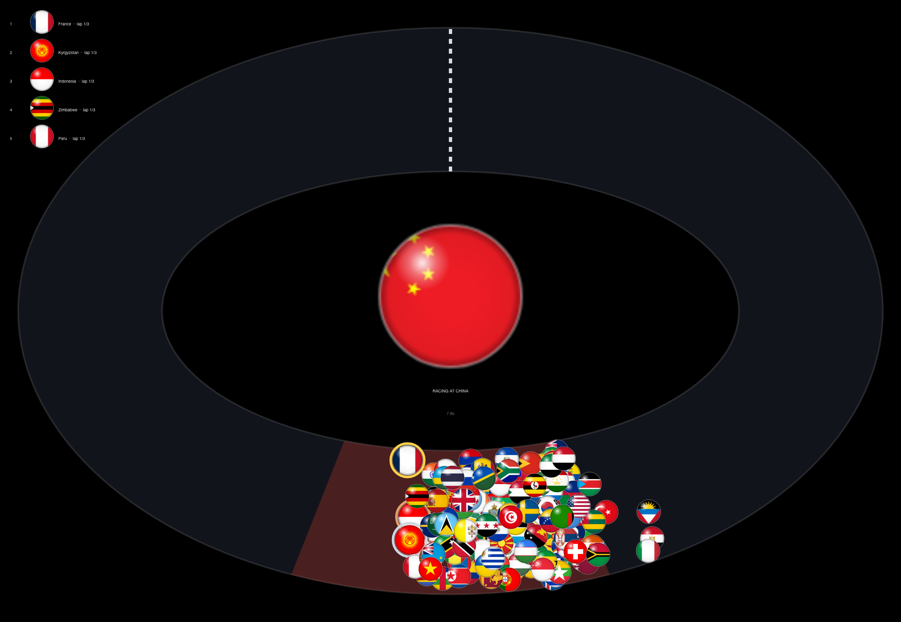
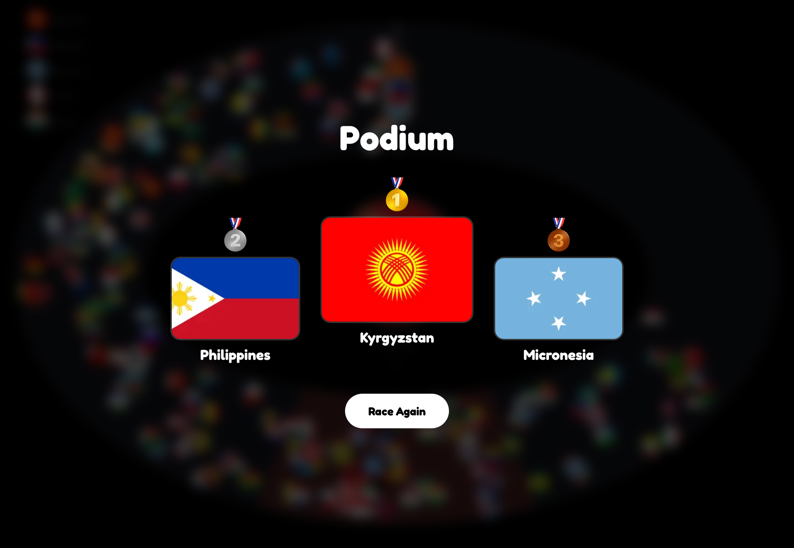
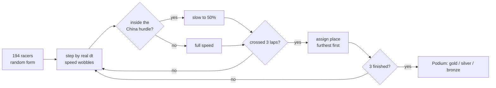

# Country Racer

> Load the page and all 194 countries race as glossy flag marbles around an oval track, hurdling the wall at China, until a gold, silver, and bronze podium is crowned. No menus, no clicks - just watch. A tiny, playful game for kids.

<p>
  
  
  
  
  
</p>

**Live:** https://country-racer-bheng.vercel.app



---

## What it does

- On load, all **194 recognized countries** (193 UN members + Vatican City) line up as **glossy 3D-look flag marbles** and start racing around an oval loop.
- They jockey the whole way - constant overtaking - and must push through the **hurdle band at China**, the host, which sits glinting in the centre.
- A **live top-5 standings** panel updates in real time so you can follow who is leading and which lap they are on.
- The whole race runs in **about 35-55 seconds**, then the first 3 across the line take the **podium**: gold, silver, bronze.
- Tap **Race Again** for a fresh random field. That is the only control.



---

## How the race works

The race is a small, **pure, unit-tested core** (`lib/race.ts`) driven by a single `requestAnimationFrame` loop on a 2D canvas.



Three ideas keep it fun **and** smooth:

- **194 racers stay buttery-smooth** because each country's flag is **pre-baked once** into a glossy marble sprite (circular flag + highlight + spherical rim), so every frame is just cheap sprite blits - no per-frame drawing cost, even on a phone.
- **Constant overtaking** comes from a deterministic two-sine `wobble` per racer, so the pack shuffles the whole way without any real randomness in the physics.
- **The clock is real time**, so the race always finishes in a bounded ~35-55 seconds regardless of frame rate.

Every one of those rules lives behind a pure function with tests (`tests/race.test.ts`).

---

## Architecture

| Layer | Role |
| --- | --- |
| `app/page.tsx` + `layout.tsx` | Static server shell, metadata, font, icon |
| `Race.tsx` | Canvas + rAF loop + podium (one client component) |
| `lib/race.ts` | Pure, dependency-free, unit-tested race logic |
| `data/countries.ts` | 194 countries (code, name, accent hue) |
| `public/flags/` | 194 self-hosted flag PNGs |

The 194 flags are **self-hosted**, so there is no third-party CDN dependency and the Content-Security-Policy stays locked to `'self'`. The only runtime dependencies are React and Next - no game engine, no 3D library.

## Design decisions and trade-offs

| Decision | Chosen | Alternative | Why | Cost we accept |
| --- | --- | --- | --- | --- |
| Renderer | 2D canvas sprites | 194 WebGL/3D marbles | Smooth with 194 racers on mobile | 2D "glossy" look, not true 3D |
| Marbles | Pre-baked sprites | Draw flag + gloss each frame | Near-zero per-frame cost | A one-time bake on load |
| Flags | Self-hosted PNGs | Remote flag CDN | No third-party dependency; CSP `'self'` | ~800KB committed |
| Randomness | Deterministic sine wobble | Real RNG per frame | Testable, reproducible physics | Tuned, not truly random paths |
| Race length | Real-time clock + 3-lap finish | Fixed frame count | Always 35-55s on any device | - |

---

## Tech stack

- **Framework:** Next.js 16 (App Router, static prerender)
- **UI runtime:** React 19
- **Rendering:** HTML5 Canvas 2D
- **Language:** TypeScript (strict)
- **Styling:** Tailwind CSS 4
- **Tests:** node:test (unit) + Playwright (e2e)
- **Hosting:** Vercel

---

## Quick start

```bash
git clone https://github.com/bunlongheng/country-racer.git
cd country-racer
npm install
npm run dev            # http://localhost:3030
```

No environment variables are required - it is a fully static, self-contained game.

### Scripts

| Command | What it does |
| --- | --- |
| `npm run dev` | Start the dev server on port 3030 |
| `npm run build` | Production build |
| `npm run typecheck` | `tsc --noEmit` |
| `npm run lint` | ESLint (typescript-eslint + next core-web-vitals) |
| `npm test` | Unit tests for the race core + country data |
| `npm run test:e2e` | Playwright end-to-end race |

---

## Configuration

No environment variables required.

## Project layout

```
app/
  page.tsx              server shell
  components/Race.tsx   canvas race loop + podium
  data/countries.ts     194 countries (code, name, accent hue)
lib/
  race.ts               pure, tested race logic
public/flags/           194 self-hosted flag PNGs
tests/                  unit tests (race + data)
e2e/                    Playwright race test
```

---

## License

[MIT](LICENSE) (c) Bunlong Heng
